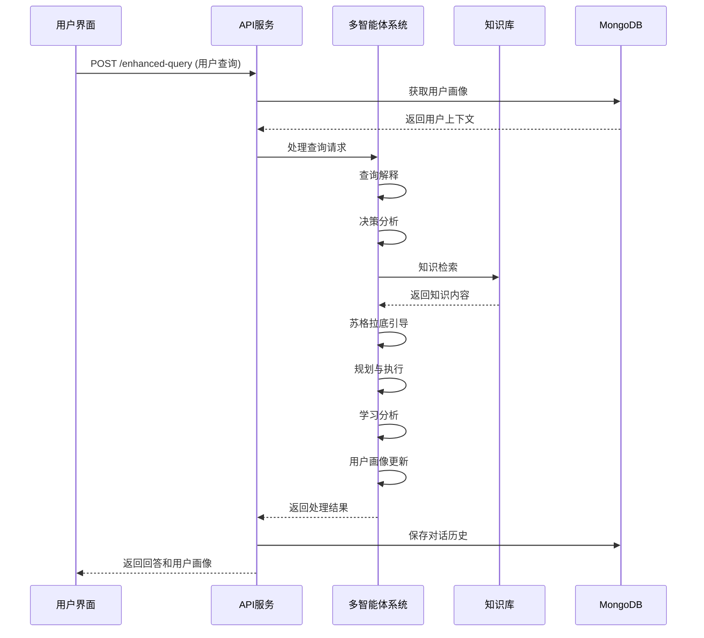

# 多智能体学习助手技术文档

## 系统概述

多智能体学习助手是一个基于FastAPI的智能教育系统，采用多智能体协作架构，集成了图谱知识库检索(nano-graphrag)、苏格拉底式教学、增强学习分析和用户画像管理等先进技术，为用户提供个性化的交互式学习体验。

### 核心特性

- **多智能体协作**：8个专业智能体协同工作，各司其职
- **图谱知识检索**：基于nano-graphrag的语义搜索和知识图谱
- **苏格拉底式教学**：智能问答引导，促进深度思考
- **个性化学习**：根据用户理解水平动态调整教学策略
- **用户画像管理**：构建和维护用户知识图谱
- **实时交互**：支持多轮对话和状态管理
- **可视化界面**：现代化Web界面，支持响应式设计
- **MongoDB存储**：支持用户数据和对话历史的持久化存储


## 系统架构

### 整体架构图

```
┌─────────────────────────────────────────────────────────────┐
│                    前端用户界面                              │
│              (multi_agent_interface.html)                   │
└─────────────────────┬───────────────────────────────────────┘
                      │ HTTP/WebSocket
┌─────────────────────▼───────────────────────────────────────┐
│                FastAPI应用层                                │
│                 (src/app.py)                                │
├─────────────────────┬───────────────────────────────────────┤
│              增强版多智能体路由                              │
│      (src/routers/enhanced_multi_agent_router.py)          │
└─────────────────────┬───────────────────────────────────────┘
                      │
┌─────────────────────▼───────────────────────────────────────┐
│              多智能体系统核心                                │
│         (src/agents/multi_agent_system.py)                  │
├─────────────────────┬───────────────────────────────────────┤
│                智能体注册表                                  │
│              (src/utils/registry.py)                        │
└─────────────────────┬───────────────────────────────────────┘
                      │
     ┌────────────────┼────────────────┐
     │                │                │
┌────▼────┐    ┌─────▼─────┐    ┌─────▼─────┐
│查询解释  │    │决策分析   │    │知识检索   │
│智能体    │    │智能体     │    │智能体     │
└─────────┘    └───────────┘    └─────┬─────┘
                                      │
     ┌────────────────┬─────────────────▼─────────────────┐
     │                │                                   │
┌────▼────┐    ┌─────▼─────┐    ┌─────▼─────┐    ┌──────▼──────┐
│苏格拉底  │    │规划智能体 │    │执行智能体 │    │学习分析     │
│引导智能体│    │           │    │           │    │智能体       │
└─────────┘    └───────────┘    └───────────┘    └─────────────┘
                                      │
                              ┌───────▼────────┐
                              │  用户画像      │
                              │  智能体        │
                              └────────────────┘
                                      │
                              ┌───────▼────────┐
                              │  知识库层      │
                              │               │
                              │ • nano-graphrag│
                              │ • 概念知识库   │
                              │ • 学习数据     │
                              │ • MongoDB存储  │
                              └────────────────┘
```

### 智能体详细说明

#### 1. 查询解释智能体 (QueryInterpreterIntegratedAgent)
- **功能**：解析用户查询意图，识别查询类型，集成用户画像分析
- **输入**：用户原始查询和用户上下文
- **输出**：查询解释结果，包含关键词、意图分类、用户画像关联等
- **位置**：`src/agents/query_interpreter_integrated.py`

#### 2. 决策分析智能体 (DecisionAgent)
- **功能**：分析查询复杂度，决定检索策略，生成优化查询
- **输入**：查询解释结果
- **输出**：检索决策、优化查询列表、核心概念
- **位置**：`src/agents/decision_agent.py`

#### 3. 知识检索智能体 (KnowledgeRetrieverAgent)
- **功能**：从nano-graphrag知识库检索相关信息
- **输入**：优化查询和目标概念
- **输出**：检索到的知识内容和相关性评分
- **位置**：`src/agents/knowledge_retriever.py`

#### 4. 苏格拉底引导智能体 (SocraticGuideAgent)
- **功能**：生成启发式问题，引导用户深度思考
- **输入**：当前对话状态和用户理解水平
- **输出**：苏格拉底式问题
- **位置**：`src/agents/socratic_guide.py`

#### 5. 规划智能体 (PlannerAgent)
- **功能**：制定回答策略和学习路径
- **输入**：检索到的知识和用户状态
- **输出**：回答规划和学习目标
- **位置**：`src/agents/planner.py`

#### 6. 执行智能体 (ExecutorAgent)
- **功能**：生成最终回答内容
- **输入**：规划结果和检索知识
- **输出**：格式化的回答内容
- **位置**：`src/agents/executor.py`

#### 7. 学习分析智能体 (LearnerAgent)
- **功能**：分析学习效果，提供个性化反馈
- **输入**：完整的交互历史
- **输出**：学习分析报告和改进建议
- **位置**：`src/agents/learner.py`

#### 8. 用户画像智能体 (UserProfileIntegratedAgent)
- **功能**：构建和维护用户知识图谱，分析用户学习模式
- **输入**：用户交互历史和查询内容
- **输出**：用户画像更新和学习建议
- **位置**：`src/agents/user_profile_integrated.py`

## 知识检索机制详解

### nano-graphrag检索（当前实现）

#### 工作原理
1. **文档预处理**：将概念文档分割成文本块
2. **实体提取**：识别关键实体和关系
3. **图谱构建**：构建知识图谱结构
4. **向量嵌入**：生成1024维语义向量
5. **混合检索**：结合图谱和向量相似度搜索

#### 数据存储位置
检索到的信息存储在以下位置：
```
concept_knowledge_bases/
├── {概念名称}/
│   ├── knowledge.txt                    # 原始知识文档
│   └── graphrag_cache/                  # GraphRAG处理后的数据
│       ├── kv_store_full_docs.json     # 完整文档存储
│       ├── kv_store_text_chunks.json   # 文本块存储
│       ├── kv_store_community_reports.json # 社区报告
│       ├── vdb_entities.json           # 实体向量数据库
│       └── graph_chunk_entity_relation.graphml # 知识图谱文件
```

#### 检索流程
```python
# 在KnowledgeRetrieverAgent中的实际检索流程
async def execute(self, state: AgentState) -> AgentState:
    # 1. 获取优化查询策略
    optimized_queries = self._get_optimized_queries(state)
    
    # 2. 识别目标概念
    target_concepts = self._identify_target_concepts_enhanced(state)
    
    # 3. 并发执行检索
    retrieval_results = await self._execute_concurrent_retrieval(
        optimized_queries, target_concepts
    )
    
    # 4. 结果排序和去重
    results = self._rank_and_deduplicate_results(retrieval_results)
    
    # 5. 更新状态
    state.retrieved_knowledge = {
        "results": results,
        "successful_sources": successful_sources,
        "total_results": len(results)
    }
```

### 增强检索机制

#### 1. 增强检索器 (EnhancedRetriever)
```python
# 在processors/enhanced_retriever.py中
class EnhancedRetriever:
    def __init__(self):
        self.cache_manager = CacheManager()
        self.text_processor = TextProcessor()
    
    async def retrieve(self, query: str, context: Dict) -> List[Dict]:
        # 实现增强检索逻辑
        # 支持缓存、多模态检索、用户画像关联等
        return results
```

#### 2. MongoDB存储支持
```python
# 在services/mongodb_integration.py中
class MongoDBService:
    async def save_conversation(self, session_id: str, user_id: str, 
                               query: str, response: str):
        # 保存对话历史到MongoDB
        pass
    
    async def get_user_profile(self, user_id: str) -> Dict:
        # 获取用户画像
        pass
```

## API接口设计

### 核心API端点

#### 1. 增强查询处理接口
```
POST /api/enhanced-query
```

**请求参数**：
```json
{
    "query": "用户查询内容",
    "session_id": "可选的会话ID",
    "user_id": "用户ID",
    "user_context": {
        "learning_preferences": "学习偏好",
        "previous_topics": ["历史概念"]
    },
    "config": {
        "enable_socratic": true,
        "max_iterations": 5
    },
    "force_mode": "normal"
}
```

**响应数据**：
```json
{
    "success": true,
    "session_id": "generated-session-id",
    "final_response": "智能体系统的完整回答",
    "query_classification": {
        "intent": "concept_explanation",
        "complexity": "medium",
        "keywords": ["概念1", "概念2"]
    },
    "execution_summary": {
        "steps_completed": ["query_interpreter", "decision_agent", "knowledge_retriever"],
        "knowledge_sources": ["概念1", "概念2"],
        "retrieval_strategy": "enhanced_multi_query_cached"
    },
    "user_profile_context": {
        "learning_level": "intermediate",
        "preferred_topics": ["历史", "政治"]
    },
    "conversation_saved": true,
    "timestamp": "2024-01-15T10:30:00Z"
}
```

#### 2. 用户画像管理接口

##### 获取用户画像
```
GET /api/user-profile/{user_id}
```

##### 获取用户画像图谱
```
GET /api/user-profile-graph
```

##### 清除用户画像
```
POST /api/clear-user-profile
```

#### 3. 会话管理接口

##### 获取用户会话历史
```
GET /api/user-sessions/{user_id}
```

##### 获取会话详情
```
GET /api/session-history/{session_id}
```

#### 4. 存储管理接口

##### 数据清理
```
POST /api/storage/cleanup
```

##### 获取存储统计
```
GET /api/storage/stats
```

##### 导出用户数据
```
POST /api/storage/export-user-data/{user_id}
```

##### 数据备份
```
POST /api/storage/backup
```

#### 5. 系统监控接口

##### 健康检查
```
GET /api/health-enhanced
```

##### 系统统计
```
GET /api/stats
```

### 前后端交互流程

#### 1. 标准查询流程


## 数据流分析

### 输入数据格式

#### 1. 用户查询输入
```json
{
    "query": "请解释一下大化改新的历史意义",
    "session_id": null,
    "user_id": "user_123",
    "user_context": {
        "learning_level": "intermediate",
        "previous_topics": ["奈良时代", "律令制"]
    }
}
```

#### 2. 苏格拉底对话输入
```json
{
    "query": "我觉得大化改新主要是政治制度的变革",
    "session_id": "session_456",
    "user_id": "user_123",
    "force_mode": "socratic"
}
```

### 中间处理数据

#### 1. 查询解释结果
```json
{
    "interpretation": {
        "intent": "concept_explanation",
        "keywords": ["大化改新", "历史意义"],
        "complexity": "medium",
        "topic_category": "历史",
        "query_type": "concept_explanation",
        "user_profile_related": true
    }
}
```

#### 2. 决策分析结果
```json
{
    "retrieval_decision": {
        "need_retrieval": true,
        "retrieval_strategy": "concept_focused",
        "core_concepts": ["大化改新", "律令制", "奈良时代"],
        "optimized_queries": [
            {
                "query": "大化改新的政治制度改革",
                "strategy": "exact_match",
                "priority": 1.0
            },
            {
                "query": "大化改新对日本社会的影响",
                "strategy": "semantic_match",
                "priority": 0.8
            }
        ]
    }
}
```

#### 3. 知识检索结果
```json
{
    "retrieved_knowledge": {
        "target_concepts": ["大化改新"],
        "results": [
            {
                "concept": "大化改新",
                "content": "大化改新是日本7世纪的重大政治改革...",
                "relevance_score": 0.95,
                "source": "concept_database:大化改新",
                "content_length": 1500
            }
        ],
        "total_results": 3,
        "retrieval_strategy": "enhanced_multi_query_cached"
    }
}
```

### 输出数据格式

#### 1. 标准回答输出
```json
{
    "success": true,
    "session_id": "session_789",
    "final_response": "# 大化改新的历史意义\n\n大化改新（645年）是日本历史上的重要转折点...\n\n💭 你认为大化改新最重要的改革措施是什么？为什么？",
    "query_classification": {
        "intent": "concept_explanation",
        "complexity": "medium",
        "keywords": ["大化改新", "历史意义"]
    },
    "user_profile_context": {
        "learning_level": "intermediate",
        "preferred_topics": ["历史", "政治"],
        "knowledge_gaps": ["社会结构变化", "文化影响"]
    }
}
```

#### 2. 学习分析输出
```json
{
    "learning_feedback": {
        "summary": "用户对大化改新的政治层面有基础理解，但缺乏对社会文化影响的认识",
        "strengths": ["能够识别政治制度变革", "理解改革的重要性"],
        "knowledge_gaps": ["社会结构变化", "文化影响", "长远历史意义"],
        "recommendations": [
            "建议深入学习律令制的具体内容",
            "了解大化改新对后续历史发展的影响",
            "比较研究同时期其他国家的改革"
        ],
        "understanding_progression": {
            "initial": "surface_understanding",
            "current": "basic_understanding",
            "target": "good_understanding"
        }
    }
}
```

## 技术栈

### 后端技术
- **Web框架**：FastAPI 0.100+
- **异步处理**：asyncio, uvicorn
- **AI模型**：Ollama (本地部署)
- **知识图谱**：nano-graphrag
- **数据处理**：pandas, numpy
- **日志记录**：loguru, structlog
- **数据库**：MongoDB (pymongo, motor, beanie)
- **文本处理**：jieba, sentence-transformers
- **机器学习**：scikit-learn, transformers, torch

### 前端技术
- **核心技术**：HTML5, CSS3, JavaScript (ES6+)
- **UI框架**：原生CSS Grid/Flexbox
- **Markdown渲染**：marked.js
- **图标库**：内联SVG
- **响应式设计**：CSS媒体查询

### 数据存储
- **知识库**：文件系统 + GraphRAG索引
- **用户数据**：MongoDB (用户画像、对话历史)
- **缓存**：内存缓存 + 文件缓存
- **会话**：内存存储 + MongoDB持久化
- **日志**：文件日志系统

## 项目结构

```
hw_agent/
├── src/                          # 源代码目录
│   ├── agents/                   # 智能体模块
│   │   ├── __init__.py
│   │   ├── base.py              # 智能体基类
│   │   ├── multi_agent_system.py # 多智能体系统核心
│   │   ├── query_interpreter_integrated.py # 查询解释智能体
│   │   ├── decision_agent.py     # 决策分析智能体
│   │   ├── knowledge_retriever.py # 知识检索智能体
│   │   ├── socratic_guide.py     # 苏格拉底引导智能体
│   │   ├── planner.py           # 规划智能体
│   │   ├── executor.py          # 执行智能体
│   │   ├── learner.py           # 学习分析智能体
│   │   └── user_profile_integrated.py # 用户画像智能体
│   ├── routers/                 # API路由
│   │   ├── __init__.py
│   │   └── enhanced_multi_agent_router.py # 增强版多智能体API路由
│   ├── processors/              # 数据处理器
│   │   ├── __init__.py
│   │   ├── concept_knowledge_processor.py # 概念知识处理器
│   │   └── enhanced_retriever.py # 增强检索器
│   ├── services/                # 服务层
│   │   ├── mongodb_integration.py # MongoDB集成服务
│   │   ├── conversation_storage_manager.py # 对话存储管理
│   │   └── storage_service.py   # 存储服务
│   ├── utils/                   # 工具模块
│   │   ├── __init__.py
│   │   ├── llm.py              # LLM客户端管理
│   │   ├── data_models.py      # 数据模型
│   │   ├── enums.py            # 枚举定义
│   │   └── registry.py         # 注册表管理
│   ├── tools/                   # 通用工具
│   │   ├── __init__.py
│   │   ├── cache_manager.py    # 缓存管理
│   │   ├── file_utils.py       # 文件工具
│   │   ├── text_processor.py   # 文本处理
│   │   └── log_manager.py      # 日志管理
│   ├── user_graph/             # 用户知识图谱
│   │   ├── extractor.py        # 图谱提取器
│   │   ├── updater.py          # 图谱更新器
│   │   └── visualizer.py       # 图谱可视化
│   ├── models/                 # 数据模型
│   │   └── database_models.py  # 数据库模型
│   ├── config/                 # 配置管理
│   │   ├── __init__.py
│   │   ├── config_manager.py   # 配置管理器
│   │   ├── config.yaml         # 主配置文件
│   │   ├── logging_config.py   # 日志配置
│   │   └── database.py         # 数据库配置
│   ├── nano_graphrag/          # GraphRAG知识图谱
│   │   └── ...                 # GraphRAG相关文件
│   ├── app.py                  # FastAPI应用入口
│   └── prompts.py              # 提示词管理
├── static/                     # 静态文件
│   └── multi_agent_interface.html # Web前端界面
├── concept_knowledge_bases/    # 概念知识库
│   └── {概念名称}/
│       ├── knowledge.txt       # 概念知识文档
│       └── graphrag_cache/     # GraphRAG处理数据
├── data/                       # 数据目录
│   ├── learning/              # 学习数据
│   ├── enhanced_learning/     # 增强学习数据
│   ├── conversations/         # 对话历史
│   ├── user_profiles/         # 用户画像
│   └── backups/               # 数据备份
├── logs/                      # 日志文件
├── scripts/                   # 脚本文件
├── requirements.txt           # Python依赖
└── README.md                  # 项目文档
```

## 快速开始

### 5分钟快速体验

1. **克隆项目**
```bash
git clone <repository-url>
cd hw_agent
```

2. **安装依赖**
```bash
pip install -r requirements.txt
```

3. **启动服务**
```bash
python src/app.py
```

4. **访问系统**
- Web界面：http://localhost:8000
- API文档：http://localhost:8000/docs

### 完整部署

#### 环境要求
- Python 3.8+
- MongoDB 4.4+ (用于用户数据和对话存储)
- Ollama (本地LLM服务，推荐)
- 8GB+ RAM（推荐）
- 10GB+ 磁盘空间

#### 安装步骤

1. **克隆项目**
```bash
git clone <repository-url>
cd hw_agent
```

2. **安装依赖**
```bash
pip install -r requirements.txt
```

3. **配置MongoDB**
```bash
# 启动MongoDB服务
mongod --dbpath /path/to/data/db

# 或使用Docker
docker run -d -p 27017:27017 --name mongodb mongo:latest
```

4. **配置Ollama模型**
```bash
# 安装所需模型
ollama pull qwen2.5:ctx32k      # LLM模型
ollama pull bge-m3:latest       # 嵌入模型
```

5. **配置系统**
```bash
# 复制配置文件
cp src/config/config.yaml.example src/config/config.yaml

# 编辑配置文件，设置MongoDB连接等
vim src/config/config.yaml
```

6. **启动服务**
```bash
# 开发环境
python src/app.py

# 生产环境
uvicorn src.app:app --host 0.0.0.0 --port 8000 --workers 4
```

7. **访问系统**
- Web界面：http://localhost:8000
- API文档：http://localhost:8000/docs
- ReDoc文档：http://localhost:8000/redoc

#### 配置说明

系统支持多种配置选项：

```yaml
# src/config/config.yaml
mongodb:
  uri: "mongodb://localhost:27017"
  database: "hw_agent"
  collections:
    users: "users"
    conversations: "conversations"
    user_profiles: "user_profiles"

llm:
  provider: "ollama"
  models:
    main: "qwen2.5:ctx32k"
    embedding: "bge-m3:latest"

system:
  max_iterations: 5
  timeout_seconds: 300
  enable_learning: true
  enable_socratic: true
  enable_mongodb: true
  enable_query_classification: true
```

## 扩展与定制

### 添加新的智能体

1. **创建智能体类**
```python
# src/agents/new_agent.py
from agents.base import BaseAgent, AgentState

class NewAgent(BaseAgent):
    def __init__(self):
        super().__init__(name="NewAgent", description="新智能体")
    
    def can_execute(self, state: AgentState) -> bool:
        return True
    
    async def execute(self, state: AgentState) -> AgentState:
        # 实现智能体逻辑
        return state
```

2. **注册智能体**
```python
# 在src/utils/registry.py中添加
from agents.new_agent import NewAgent

AGENT_REGISTRY = {
    "NewAgent": NewAgent(),
    # ... 其他智能体
}
```

### 自定义知识检索

如果要替换nano-graphrag检索：

1. **实现自定义检索器**
```python
# src/processors/custom_retriever.py
class CustomRetriever:
    def __init__(self, data_source):
        self.data_source = data_source
        self.cache_manager = CacheManager()
    
    async def search(self, query: str) -> List[Dict]:
        # 实现自定义检索逻辑
        results = []
        # 检索结果可以存储在：
        # - 内存缓存：self.cache_manager.set(query, results)
        # - MongoDB：await mongodb_service.save_search_results(query, results)
        return results
```

2. **集成到知识检索智能体**
```python
# 在knowledge_retriever.py中
from processors.custom_retriever import CustomRetriever

def _custom_retrieval(self, query: str) -> Dict:
    retriever = CustomRetriever(self.data_source)
    results = await retriever.search(query)
    
    # 存储检索结果到MongoDB
    await mongodb_service.save_search_results(
        session_id=session_id,
        query=query,
        results=results
    )
    
    return {"results": results}
```

### API扩展

添加新的API端点：

```python
# 在enhanced_multi_agent_router.py中
@enhanced_router.post("/custom-endpoint")
async def custom_endpoint(request: CustomRequest):
    try:
        # 自定义处理逻辑
        result = await process_custom_request(request)
        return {"success": True, "data": result}
    except Exception as e:
        raise HTTPException(status_code=500, detail=str(e))
```

### 用户画像扩展

添加新的用户画像维度：

```python
# 在user_profile_integrated.py中
class UserProfileIntegratedAgent(BaseAgent):
    async def _analyze_learning_style(self, user_data: Dict) -> Dict:
        # 分析用户学习风格
        learning_style = {
            "visual": 0.7,
            "auditory": 0.3,
            "kinesthetic": 0.5
        }
        return learning_style
    
    async def _update_user_preferences(self, user_id: str, preferences: Dict):
        # 更新用户偏好到MongoDB
        await mongodb_service.update_user_preferences(user_id, preferences)
```

## 故障排除

### 常见问题

1. **MongoDB连接失败**
   - 检查MongoDB服务是否启动
   - 确认连接字符串正确
   - 检查网络连接和防火墙设置

2. **Ollama连接失败**
   - 检查Ollama服务是否启动
   - 确认模型已正确安装
   - 验证API端点可访问

3. **知识库构建失败**
   - 检查concept_knowledge_bases目录权限
   - 确认GraphRAG缓存文件完整性
   - 验证nano-graphrag依赖安装

4. **内存使用过高**
   - 调整max_cache_size参数
   - 定期清理过期会话
   - 优化MongoDB查询

### 日志分析

系统日志位于`logs/hw_agent.log`，包含详细的执行信息：

```bash
# 查看实时日志
tail -f logs/hw_agent.log

# 搜索特定错误
grep "ERROR" logs/hw_agent.log

# 查看MongoDB相关日志
grep "MongoDB" logs/hw_agent.log

# 查看智能体执行日志
grep "Agent" logs/hw_agent.log
```

### 性能监控

```bash
# 查看系统资源使用
htop

# 监控MongoDB性能
mongosh --eval "db.serverStatus()"

# 检查API响应时间
curl -w "@curl-format.txt" -o /dev/null -s "http://localhost:8000/api/health"
```

## 性能优化

### 缓存策略
- **查询缓存**：重复查询直接返回缓存结果
- **知识检索缓存**：检索结果本地缓存1小时
- **用户画像缓存**：用户数据内存缓存30分钟
- **MongoDB连接池**：复用数据库连接

### 并发处理
- **异步智能体执行**：支持并发处理多个查询
- **并发知识检索**：同时检索多个概念
- **异步MongoDB操作**：使用motor驱动异步数据库操作
- **连接池管理**：复用LLM和数据库连接

### 资源管理
- **自动清理过期会话**：定期清理24小时前的会话
- **缓存大小限制**：防止内存溢出
- **MongoDB索引优化**：为常用查询字段创建索引
- **线程池管理**：合理配置并发数量

### 数据库优化

```javascript
// MongoDB索引优化
db.conversations.createIndex({"user_id": 1, "timestamp": -1})
db.user_profiles.createIndex({"user_id": 1})
db.search_results.createIndex({"query": 1, "timestamp": -1})

// 查询优化
db.conversations.find({"user_id": "user123"}).sort({"timestamp": -1}).limit(10)
```

## 开发注意事项

1. **状态管理**：AgentState在智能体间传递，包含完整上下文
2. **错误处理**：每个智能体都有独立的错误处理机制
3. **日志记录**：详细记录执行过程，便于调试
4. **配置管理**：支持运行时动态配置调整
5. **扩展性设计**：模块化架构，易于添加新功能
6. **数据一致性**：MongoDB事务确保数据一致性
7. **异步编程**：所有I/O操作使用异步模式
8. **类型安全**：使用Pydantic模型确保数据验证


### 开发环境设置

```bash
# 设置开发环境
python -m venv venv
source venv/bin/activate  # Linux/Mac
# 或
venv\Scripts\activate     # Windows

# 安装开发依赖
pip install -r requirements.txt
pip install pytest pytest-asyncio pytest-cov

# 运行测试
pytest tests/ -v --cov=src

# 代码格式化
black src/
flake8 src/
```
